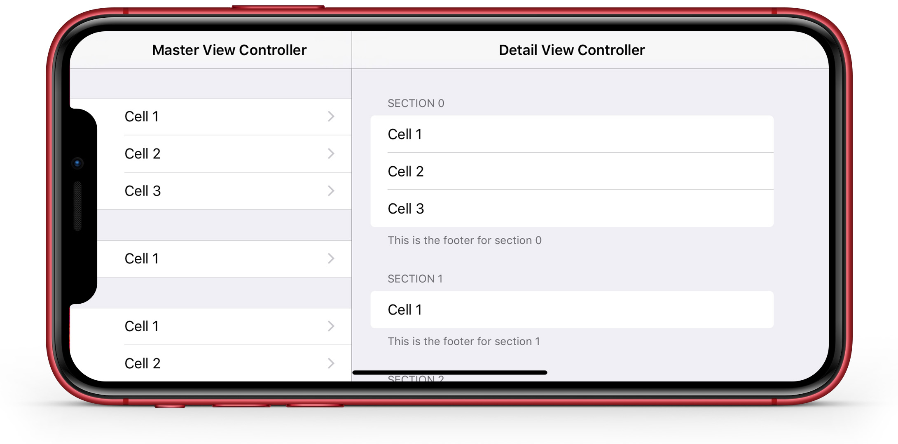

# TORoundedTableView



[](https://buildkite.com/xd-ci/toroundedtableview-run-ci)
[](http://cocoadocs.org/docsets/TORoundedTableView)
[](https://github.com/Carthage/Carthage)
[](https://raw.githubusercontent.com/TimOliver/TORoundedTableView/master/LICENSE)
[](http://cocoadocs.org/docsets/TORoundedTableView)
[](https://beerpay.io/TimOliver/TORoundedTableView)
[](https://www.paypal.com/cgi-bin/webscr?cmd=_s-xclick&hosted_button_id=M4RKULAVKV7K8)
[](http://twitch.tv/timXD)


`TORoundedTableView` is a subclass of the standard UIKit `UITableView` class. Harkening back to the days of iOS 6, it overrides the standard grouped `UITableView` appearence and behaviour to match the borderless, rounded corner style seen in the Settings app on every iPad since iOS 7.

As iOS device screens increased (Like iPhone 6 Plus and the original iPad Pro), there are a lot of UI design cases where the 'edge-to-edge' style of the stock grouped `UITableView` doesn't make sense, and will end up looking rather distorted in ultra-wide regions.

Hopefully Apple will realise this and will make the official version of this rounded table view style available in an upcoming version of iOS ([Please file all the radars.](https://bugreport.apple.com)).

# Features

* Integrates with `UITableViewController` (On account of the `tableView` property being mutable!)
* Relatively autonomous operation with only a few extra APIs required.
* Optimized to the absolute nth-degree to ensure no drops in performance or broken animations.
* Reverts back to the standard table view style in compact trait collections (Just like in Settings.app)
* Corner radius graphics are procedurally generated and can be customized on the fly.

# Sample Code

`TORoundedTableView` can easily be integrated into `UITableViewController` all you need to do is replace the `UITableView` object stored in the controller's `tableView` property befor it is shown on-screen.

`TORoundedTableView` tries to be as hands-off as possible in the amount of extra `delegate` / `dataSource` code necessary to write. However, in order to ensure maximum efficiency, a few extra bits of code are required:

In a standard `UITableViewController` implementing `TORoundedTableView`, the `tableView:cellForRowAtIndexPath:` data source method would look like this:

```objc
- (UITableViewCell *)tableView:(TORoundedTableView *)tableView cellForRowAtIndexPath:(NSIndexPath *)indexPath
{
    /*
     Because the first and last cells in a section (dubbed the 'cap' cells) do a lot of extra work on account of the rounded corners,
     for ultimate efficiency, it is recommended to create those ones separately from the ones in the middle of the section.
    */
    
    // Create identifiers for standard cells and the cells that will show the rounded corners
    static NSString *cellIdentifier     = @"Cell";
    static NSString *capCellIdentifier  = @"CapCell";
    
    // Work out if this cell needs the top or bottom corners rounded (Or if the section only has 1 row, both!)
    BOOL isTop = (indexPath.row == 0);
    BOOL isBottom = indexPath.row == ([tableView numberOfRowsInSection:indexPath.section] - 1);
    
    // Create a common table cell instance we can configure
    UITableViewCell *cell = nil;
    
    // If it's a non-cap cell, dequeue one with the regular identifier
    if (!isTop && !isBottom) {
        TORoundedTableViewCell *normalCell = [tableView dequeueReusableCellWithIdentifier:cellIdentifier];
        if (normalCell == nil) {
            normalCell = [[TORoundedTableViewCell alloc] initWithStyle:UITableViewCellStyleSubtitle reuseIdentifier:cellIdentifier];
        }
        
        cell = normalCell;
    }
    else {
        // If the cell is indeed one that needs rounded corners, dequeue from the pool of cap cells
        TORoundedTableViewCapCell *capCell = [tableView dequeueReusableCellWithIdentifier:capCellIdentifier];
        if (capCell == nil) {
            capCell = [[TORoundedTableViewCapCell alloc] initWithStyle:UITableViewCellStyleSubtitle reuseIdentifier:capCellIdentifier];
        }
        
        // Configure the cell to set the appropriate corners as rounded
        capCell.topCornersRounded = isTop;
        capCell.bottomCornersRounded = isBottom;
        cell = capCell;
    }

    // Configure the cell's label
    cell.textLabel.text = [NSString stringWithFormat:@"Cell %ld", indexPath.row+1];
    
    // Since we know the background is white, set the label's background to also be white for performance optimizations
    cell.textLabel.backgroundColor = [UIColor whiteColor];
    cell.textLabel.opaque = YES;
    
    // Return the cell
    return cell;
}
```

# Installation

`TORoundedTableView` will work with iOS 8 and above. While written in Objective-C, it should easily import into Swift as well.

## Manual Installation

To manually install this library in your app, simply [download a copy of this repo](https://github.com/TimOliver/TORoundedTableView/archive/master.zip). When the download has completed, copy the contents of the `TORoundedTableView` folder to your app project folder, and then import it into your Xcode project.

## CocoaPods

To integrate `TORoundedTableView`, simply add the following to your podfile:

```
pod 'TORoundedTableView'
```

## Carthage

To integrate `TORoundedTableView`, simply add the following to your Cartfile:

```
github "TimOliver/TORoundedTableView"
```

# Classes

`TORoundedTableView` consists of 4 separate classes that are used in tandem together to achieve the desired functionality.

### `TORoundedTableView`

A very basic subclass wrapper for `UITableView` that overrides the original 'edge-to-edge' philosophy by manually re-laying out all of the content views in a more narrow column. It also creates and manages the rounded corner image assets, so they can be efficiently shared amongst all cells.

### `TORoundedTableViewCell`

A very small wrapper for `UITableViewCell` that internally overrides the cell's `frame` property, constraining all cells to the narrower column width of the parent `TORoundedTableView`.

### `TORoundedTableViewCapCell`

A subclass of `TORoundedTableViewCell` that provides the additional logic needed to manage the views responsible for drawing the rounded corners, and overriding the `UITableViewCell` behaviour of placing hairline borders on the top and bottoms of sections.

### `TORoundedTableViewCellBackground`
The view in charge of drawing the rounded edges on the cells at the top and bottom of the section, instances are set as the `backgroundView` and `selectedBackgroundView` for each `TORoundedTableViewCapCell`. The drawing is handled by 3 solid `CALayer` objects that fill the view, and 4 additional `CALayer` objects that draw the rounded edge image in each corner.

`CALayer` objects were used instead of `UIView` to avoid `UITableViewCell`'s implicit behaviour of making `backgroundView` subviews transparent when tapped, and the laying out of a grid of layers was to ensure only the elements in the corner needed alpha-blending (For performance reasons).

# Contributing
This view is still very much in its infancy, and a lot of it hasn't been tested beyond what's in the example app. If you have a specific use case for this view, or an idea to make it better, I'd love to hear about it. Please [file an issue](https://github.com/TimOliver/TORoundedTableView/issues) outlining it, and if you're up for filing a PR, that would be fantastic.

# Why build this?

Since a similar style of `UITableView` has been prevalent in Settings.app on iPad since 2013, I'd always assumed that it was relatively trivial to modify a table view to that style if ever needed.

That assumption was put to the test this week when I needed to create a login view controller for a test app I was building at work. It turns out that assumption was very wrong and overriding `UITableView`'s edge-to-edge design scheme is actually incredibly difficult.

Given the time constraints at work, I came up with a 'compromise' that let me deliver the code on time, but I was left being really curious to see if this sort of table view style could actually be done 'properly'.

So I decided to spend several evenings this past week to implement a more elegant version of the same idea.

It turns out it really isn't easy. `UITableView` tries to reset its UI on every tick of `layoutSubviews`, and `UITableViewCell` has a lot of implicit behaviour that messed with the 'cap' background views.

In any case, after much perseverance I'm really happy I managed to get it working to a point where it's indistinguishable from the Settings.app table view. It's this sort of thrill I absolutely love in programming. :D

# Credits

`TORoundedTableView` was created by [Tim Oliver](http://twitter.com/TimOliverAU) as an experiment in insanity of reliably hacking `UITableView`.

iPhone XR device mockup by [Pixeden](http://www.pixeden.com).

# License

`TORoundedTableView` is available under the MIT license. Please see the [LICENSE](LICENSE) file for more information. 

